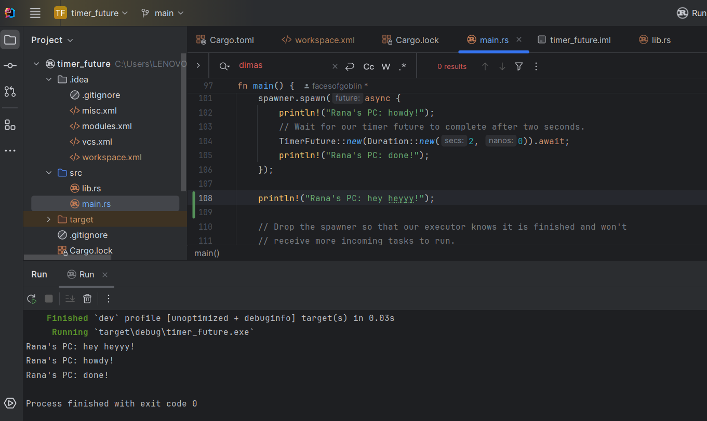
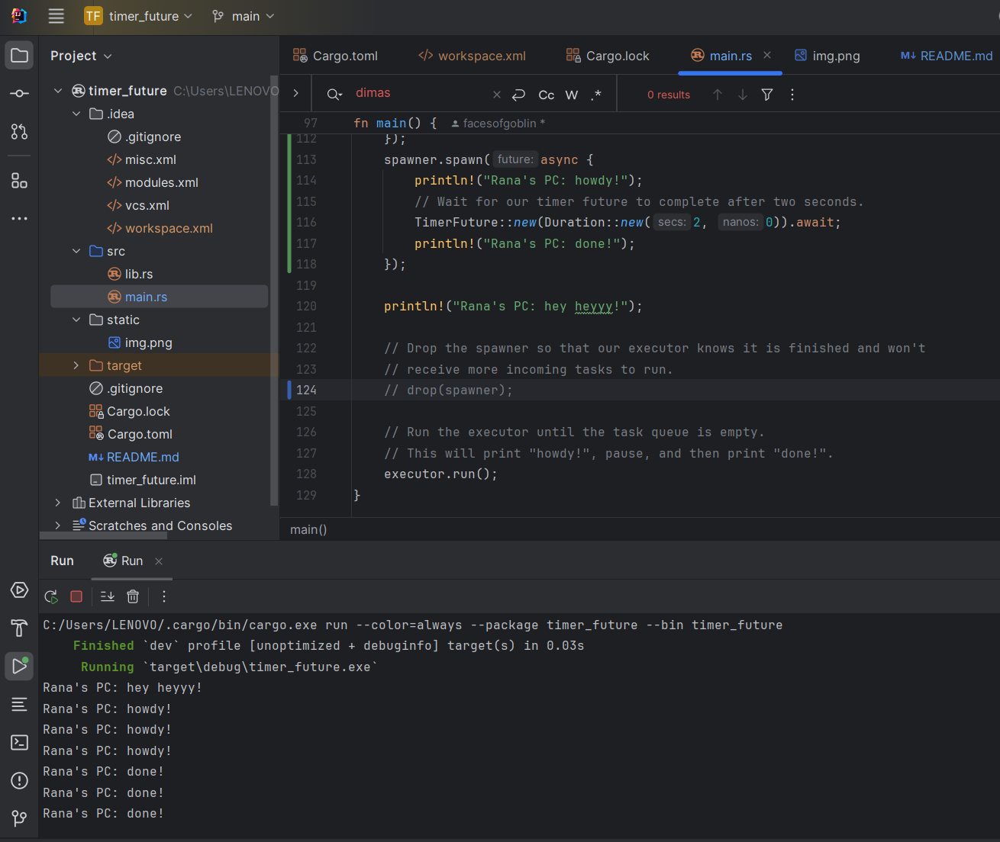
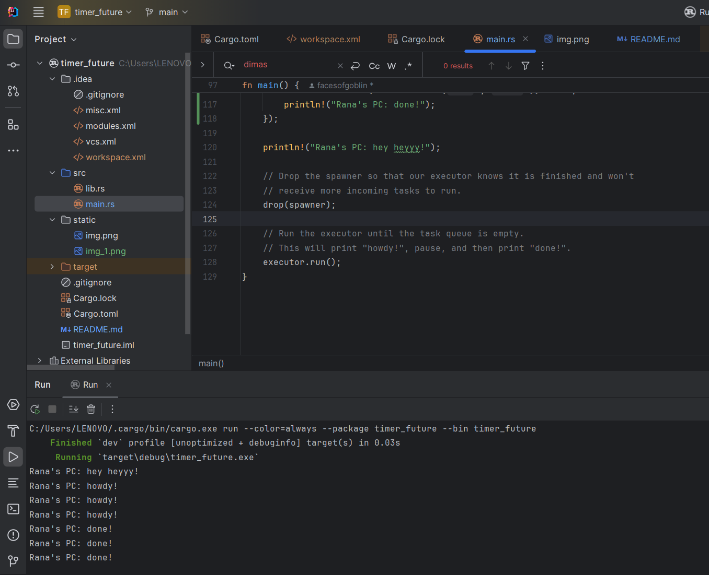

# modul10-timer

<h1>Reflection 2</h1>
<h3>Understanding why</h3>
  we can see that the async function runs separately from the main function that starts it. So, "hey hey" might be printed before "howdy!" and "done!" because "hey hey" is outside the async function. This means while the async function is still waiting to finish, the program keeps going and prints "hey hey". 

<h1>Reflection 3</h1>
<h3>Understanding why</h3>
 From the trial I conducted, I observed that the `sys.out` outside the async function printed first, followed by the `sys.out` inside the async function. However, now we know that if we replicate the async function, the program won't print 'howdy' and 'done' simultaneously but separately, since they are on two different timelines.  

